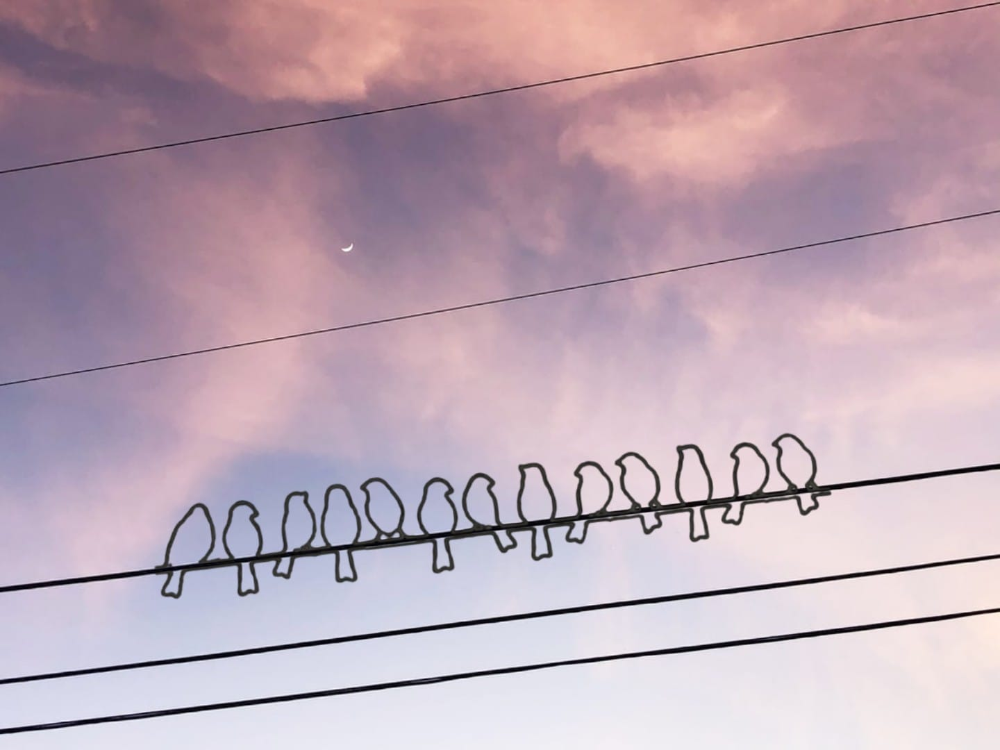

# tweeeet(upsolve)

## 問題

## 解説

``bird cryptography`` で検索すると以下の画像がヒットする．

Discordを眺めてると，こんなツールを使って解いてる人もいた．有名なのかしらこれ．

<https://www.dcode.fr/birds-on-a-wire-**cipher**>

``WELOVESINGING``

``SHELL{WELOVESINGING}``
