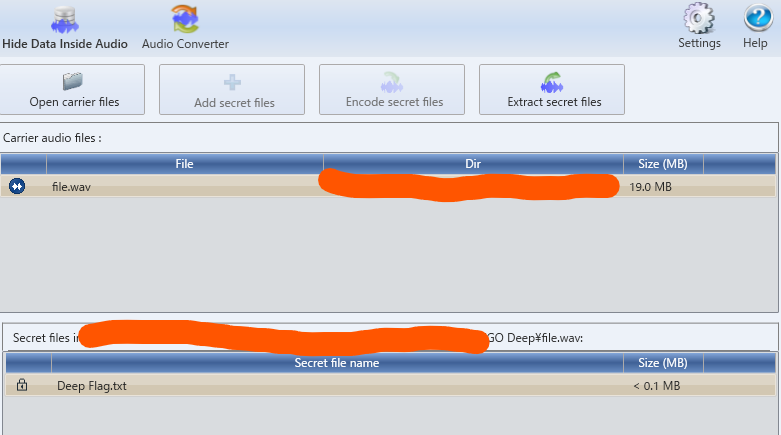

# GO Deep

## 解説

DeepSound に file.wav を投げると Deep Flag.txt が鍵付きで隠されていることがわかる．



鍵は，exiftool とかを眺めると， ``shell`` なのがわかる．

```sh
> exiftool file.wav
ExifTool Version Number         : 12.40
File Name                       : file.wav
Directory                       : .
File Size                       : 19 MiB
File Modification Date/Time     : 2022:08:11 18:52:32+09:00
File Access Date/Time           : 2022:08:13 06:31:37+09:00
File Inode Change Date/Time     : 2022:08:13 06:31:37+09:00
File Permissions                : -rw-r--r--
File Type                       : WAV
File Type Extension             : wav
MIME Type                       : audio/x-wav
Encoding                        : Microsoft PCM
Num Channels                    : 2
Sample Rate                     : 44100
Avg Bytes Per Sec               : 176400
Bits Per Sample                 : 16
ID3 Size                        : 494
Album                           : https://www.youtube.com/watch?v=dQw4w9WgXcQ
Composer                        : https://www.youtube.com/watch?v=dQw4w9WgXcQ
Year                            : Password:shell
User Defined URL                : https://www.youtube.com/watch?v=dQw4w9WgXcQ
Artist                          : https://www.youtube.com/watch?v=dQw4w9WgXcQ
Product                         : https://www.youtube.com/watch?v=dQw4w9WgXcQ
Genre                           : password:shell
Date Created                    : Password:shell
Comment                         : Password: shell
Date/Time Original              : Password:shell
Duration                        : 0:01:53
```

``SHELL{y0u_w3r3_7h1nk1ng_R3ally_D33p}``
